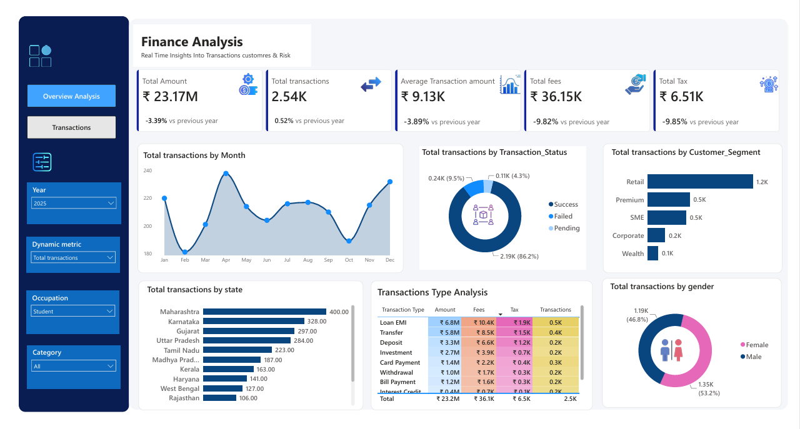
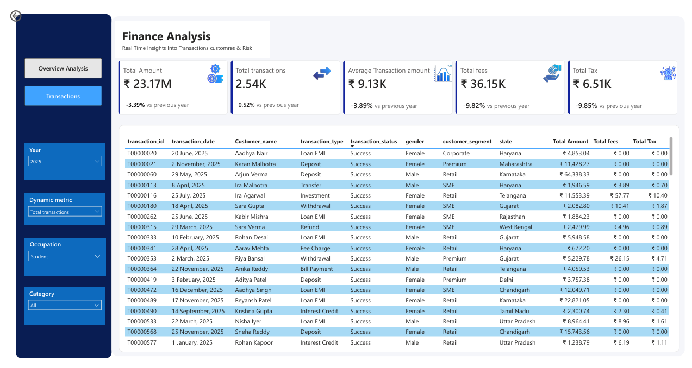

# 💰 Finance Transaction Analytics Dashboard

An end-to-end **Power BI analytics dashboard** built for a financial organization to monitor and analyze transactions, customer behavior, fees, taxes, and performance across business segments and regions.


---

## 📌 Overview

Financial management teams often struggle to track transaction growth, success/failure rates, customer segment performance, and YoY trends in one place. This project delivers a centralized, interactive dashboard that solves that problem — built from raw transactional data through to a stakeholder-ready Power BI report.

**Dataset scale:**
- 50,000+ financial transactions
- 5,000 customer records
- ₹45.6 Cr total transaction value

## 🎯 Business Objectives

The dashboard helps stakeholders:
- Monitor KPIs in real time
- Identify high-performing customer segments and states
- Analyze transaction patterns and trends
- Track operational fees and taxes
- Understand customer demographics
- Support data-driven financial decision-making

Full requirements are documented in [`Business Requirements.docx`](./Business%20Requirements.docx).

## 📊 Key KPIs Tracked

| KPI | Description |
|---|---|
| Total Amount | Total transaction value processed, with YoY growth |
| Total Transactions | Transaction volume, tracked yearly |
| Average Transaction Value | Avg. amount per transaction (~₹9,110) |
| Total Fees | Total fees collected |
| Total Tax | Total tax generated |
| Success Rate | 85.7% of transactions completed successfully |

## 📈 Dashboard Preview

**Overview Analysis**


**Transactions Drill-Through**


- **Total Amount by Month** — line/area chart of monthly transaction trends
- **Total Amount by Transaction Status** — donut chart (Success / Failed / Pending)
- **Total Amount by Customer Segment** — Retail, Premium, SME, Corporate, Wealth
- **Total Amount by State** — top-performing regions
- **Transaction Type Analysis** — matrix/heatmap across 10 transaction types (Loan EMI, Transfer, Card Payment, Investment, etc.)
- **Total Amount by Gender** — customer demographic split
- **Drill-through grid view** — record-level detail on demand

A **dynamic DAX measure selector** (SWITCH-based) lets users toggle between Amount, Fees, Tax, and Transaction Count within the same visual set, and dashboards support filtering by Year, Occupation, and Category.

## 🗂️ Repository Structure

```
├── finance_Dashboard.pbix          # Power BI dashboard file
├── finance_transactions.csv        # 50,000+ transaction records
├── customers.csv                   # 5,000 customer records
├── Business Requirements.docx      # Project scope & KPI requirements
└── Images Used/                    # Icons/assets used in the dashboard
```

## 🛠️ Tools & Techniques

- **Power BI** — data modeling, DAX, Power Query
- **DAX** — dynamic measure switching, YoY growth calculations
- **Power Query** — data cleaning and transformation
- **Data Modeling** — relational model linking transactions to customers

## 🚀 How to View

1. Clone or download this repo
2. Open `finance_Dashboard.pbix` in [Power BI Desktop](https://powerbi.microsoft.com/desktop/)
3. Data will refresh from the included CSVs

---

**Author:** [Rakeshwar M R](https://www.linkedin.com/in/rakeshwarmr/) | DP-700 Certified Data Analyst
